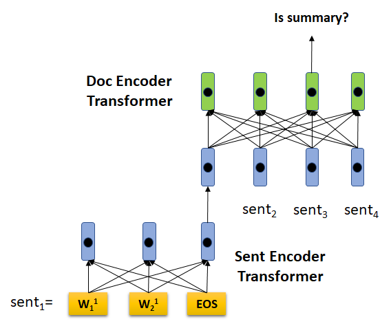

# Summarizing Summarization @ ACL 2019

## New Data, More Data

### [BIGPATENT: A Large-Scale Dataset for Abstractive and Coherent Summarization](http://arxiv.org/abs/1906.03741)

The authors introduced a novel dataset, consisting of 1.3
million records of U.S. patent documents along with human written
abstractive summaries.

Characteristics:

-   summaries contain a richer discourse structure with more recurring
    entities;

-   longer input sequences (avg. 3,572.8 VS 789.9 words for CNN/DM);

-   salient content is evenly distributed in the input, while in popular
    news-based datasets it often concentrates in the first few
    sentences;

-   fewer and shorter extractive fragments are present in the summaries.

The authors report results for various extractive and abstractive models
on CNN/DM, NYT, and Big Patent. What seems really interesting is the
divergence of results: [PointGen](http://arxiv.org/abs/1704.04368) compared favorably
against the extractive unsupervised model
[Text-Rank]() on the news-based dataset, while
obtaining worse results on Big Patent. This shows once more the
importance of testing models on several and different datasets.

### [Multi-News: a Large-Scale Multi-Document Summarization Dataset and Abstractive Hierarchical Model](http://arxiv.org/abs/1906.01749)

The authors presented the first multi-document
summarization dataset, based on news. It consists of input articles from
over 1,500 different websites along with 56,216 professional summaries
of these articles obtained from the site [newser.com](newser.com).
Additionally, the authors propose an end-to-end model that achieves
competitive results under both automatic and human evaluation on various
multi-document datasets, including Multi-News.

## Multimodal Summarization

### [Talk-Summ: A Dataset and Scalable Annotation Method for Scientific Paper Summarization Based on Conference Talks](http://arxiv.org/abs/1906.01351)

Thanks to the recent trend of publishing videos of talks in academic
conferences, @lev_talksumm:_2019 collected 1716 pairs of papers/videos
and consider the video transcripts as the summary for the related paper.
The proposed method of generating training data for scientific papers
summarization is fully automatic. Hence, the number of training data
might benefit directly from the increasing rate of papers published in a
near future without too much effort required. This would be definitely
something help full in order to follow the impressive rate of
publication in NLP and other scientific fields!

### [Multimodal Abstractive Summarization for How2 Videos](http://arxiv.org/abs/1906.07901)

The authors explored the behaviour of several models for video
summarization on the How2 dataset. They propose a multimodal approach
using automatic transcripts, the audio and the video latent
representations and combinations of them through hierarchical attention.
For the evaluation, in addition to ROUGE, the authors propose a variant
that does not account for stopwords. Interestingly enough, the presented
models include a video-only summarization model that performs
competitively with a text-only model.

## Extractive models

### [Improving the Similarity Measure of Determinantal Point Processes for Extractive Multi-Document Summarization](http://arxiv.org/abs/1906.00072)

The authors propose to tackle multi-document summarization with
Determinantal Point Processes (DPP), a learned extractive method, and
capsule network components. Motivation: TF-IDF
vectors fall short when it comes to modeling semantic similarity, a fact
that is particularly problematic for multi-document summarization.
Solution: a similarity measure for pairs of sentences such that
semantically similar sentences can receive high scores despite having
very few words in common. The capsule network is trained under a binary
classification setup, on a dataset derived from CNN/DM: the authors map
abstract sentences to the most similar article sentences (label=true)
and negative sampling (label=false).

### [Self-Supervised Learning for Contextualized Extractive Summarization](http://arxiv.org/abs/1906.04466)

A method to train an extractive model in a self-supervised fashion: the
sentence encoder is first trained to learn entailment w.r.t. to the next
sentence, replacement and switch of the next sentence. It allows to
train faster and to obtain a slight improvement on CNN/DM. The proposed
method could also lead to longer text representations in a
self-supervised manner.

### [Answering while Summarizing: Multi-task Learning for Multi-hop QA with Evidence Extraction](http://arxiv.org/abs/1905.08511)

The study focuses on HotpotQA, a multi-hop QA explainable task: the
system return the answer with the evidence sentences by reasoning and
gathering disjoint pieces of the reference texts gathering. The Query
Focused Extractor (QFE) is inspired by the extractive summarization
model proposed in [Chen et al.](http://arxiv.org/abs/1805.11080). Instead of covering the important
information in the source document with the extractive summary, the
approach covers the question with the extracted evidences. The model
compared favorably with the SOTA BERT-based model in HotpotQA distractor
setting for retrieving the evidence while not benefiting from any
pretraining. In addition, it achieves SOTA performance on the [FEVER](https://arxiv.org/abs/1803.05355)
dataset.

### [Sentence Centrality Revisited for Unsupervised Summarization](http://arxiv.org/abs/1906.03508)

The authors revisited classic extractive unsupervised summarization
using graph-based ranking approaches, where the nodes are the sentences
of a document. They leverage BERT to encode each sentence. One of
motivation is that popular supervised approaches are limited by the need
of large-scale datasets and thus does not generalize well to other
domain and languages. The model performs comparably well to SOTA
approaches on the popular CNN/DM and NYT datasets, as well as for
TTNews, a Chinese news summarization corpus showing its capability to
adapt well to different domain. A human assessment is conducted, based
on a set of question posed on the gold summary, evaluating how much
relevant information is present in a generated evaluated summary. The
application to sentence selection in multi-document summarization is
suggested as future work.

### [HIBERT: Document Level Pre-training of Hierarchical Bidirectional Transformers for Document Summarization](http://arxiv.org/abs/1905.06566)

HIBERT stands for Hierarchical BERT. The idea is to use two pretrained
transformers (see figure below): the first, a standard BERT at token level used
to represent the sentences; the second, working at sentence level and
leveraging on the representation from the former to encode sentences of
an entire document. Following the BERT masked pretraining method, the
authors trained the sentence level transformer masking some sentences of
the documents, and the final model achieves SOTA for summarization on
CNN/DM and NY times datasets. The authors also report informative
ablations, using out-of-domain, in-domain data, and a combination
thereof for the pretraining. Cherry on the cake, they adapt BERT to
extractive supervised summarization (i.e. finetuning BERT in a
classification setup to select the sentences to extract) and report the
result as a baseline.

## Abstractive models

### [Scoring Sentence Singletons and Pairs for Abstractive Summarization](http://arxiv.org/abs/1906.00077)

Abstractive summarizers tend to perform content selection and fusion
implicitly by learning to generate the text in an end-to-end manner. The
proposed method, instead, summarizes documents in a two stages process,
the first extractive and the second abstractive. The motivation is that
separating the summarization process into two explicit steps could allow
for more flexibility and explainability for each components. The
extractive stage is done using BERT representations. The extracted
sentence singletons are then fed into a sequence to sequence model to
generate the summary. Evaluations are reported for both the extractive
methods and the full pipeline on three datasets (CNN/DM, DUC and Xsum).

### [Hierarchical Transformers for Multi-Document Summarization](http://arxiv.org/abs/1905.13164)

In the original WikiSum paper, the authors proposed a two stages
process, first extracting the most important sentences from all the
documents in order to get a shorter input,
then learning to generate the output with a transformer model. On top of
that, Liu and Lapata propose to refine the extractive step
with a hierarchical representation of the documents using attention
instead of just concatenating the extracted sentences.

### [BiSET: Bi-directional Selective Encoding with Template for Abstractive Summarization](http://arxiv.org/abs/1906.05012)

Bi-directional Selective Encoding with Template (Biset) is a new
architecture for abstractive summarization tested on the Gigawords
dataset. Template-based summarization relies on manual creation of
templates. The advantage of such approach is that it results in concise
and coherent summaries without requiring training data. However, it
requires experts to build these templates. In this paper, an automatic
method is proposed to retrieve high-quality templates from training
corpus. Given an input article, the model first retrieves the most
similar articles using a TF-IDF-based method. Further, a similarity
measure is computed through a neural network in order to re-rank the
retrieved articles. The summary corresponding to the most similar
article to the input is then selected as the template. Finally a
sequence to sequence network is trained to generate the summary: the
authors propose an architecture to learn the interaction between the
source summary and the selected template.

### [Generating Summaries with Topic Templates and Structured Convolutional Decoders](http://arxiv.org/abs/1906.04687)

Most previous works on neural text generation represent the target
summaries as a single long sequence. Assuming that documents are
organized into topically coherent text segments, the authors propose a
hierarchical model that encodes both documents and sentences guided by
the topic structure of target summaries. The topic templates from
summaries are obtained via a trained Latent Dirichlet Allocation model. WikiCat-Sum, the dataset used for evaluation is
derived from WikiSum, and focuses on three
domains: Companies, Films, and Animals. The dataset is publicly
[available](https://github.com/lauhaide/WikiCatSum).

### [Global Optimization under Length Constraint for Neural Text Summarization](https://www.aclweb.org/anthology/P19-1099)

Most abstractive summarization models do not control the length of the
generated summary and learn it from the distribution of the examples
seen during training. The authors propose an optimization method under a
length constraint. They report extensive experiments on CNN/DM using
several models with different length constraints and optimization
methods. In addition to ROUGE and length control, the authors report the
average generation time, along with a human assessment.

## Evaluation

### [HighRES: Highlight-based Reference-less Evaluation of Summarization](http://arxiv.org/abs/1906.01361)

Automatic summarization evaluation is an open research question and the
current methods have several pitfalls. For this reason, most of the
papers conduct human evaluations, a challenging and time consuming task.
The authors propose a new human evaluation methodology:
first, a group of annotators highlight the salient content in the input
article. Then, other annotators are asked to score for precision (i.e.
only important information is present in the summary), recall (all
important information is present in the summary) and linguistic metrics
(clarity and fluency). Major advantages of this method:

-   highlights are not dependent on the summaries being evaluated but
    only on the source documents, thus avoiding reference bias;

-   it provides absolute instead of ranked evaluation allowing for
    better interpretability;

-   the highlight annotation needs to happen only once per document, and
    it can be reused to evaluate many system summaries.

Finally, the authors propose a version of ROUGE leveraging the highlight
annotations. The UI (see figure below) is [open source](https://github.com/sheffieldnlp/highres).

![Figure 2 of Hardy et al. The UI for content evaluation with
highlight.[]{label="fig:HIGHRES"}](img/high.png)

### [A Simple Theoretical Model of Importance for Summarization](https://www.aclweb.org/anthology/P19-1101)

In this work, the author formalizes several simple but rigorous
summary-related metrics such as redundancy, relevance, and
informativeness, under the unifying notion of: *importance*. The paper
includes several analyses to support the proposal and was recognized as
an *outstanding* contribution. We look forward to see how the proposed
framework will be adopted!

